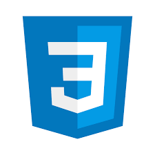
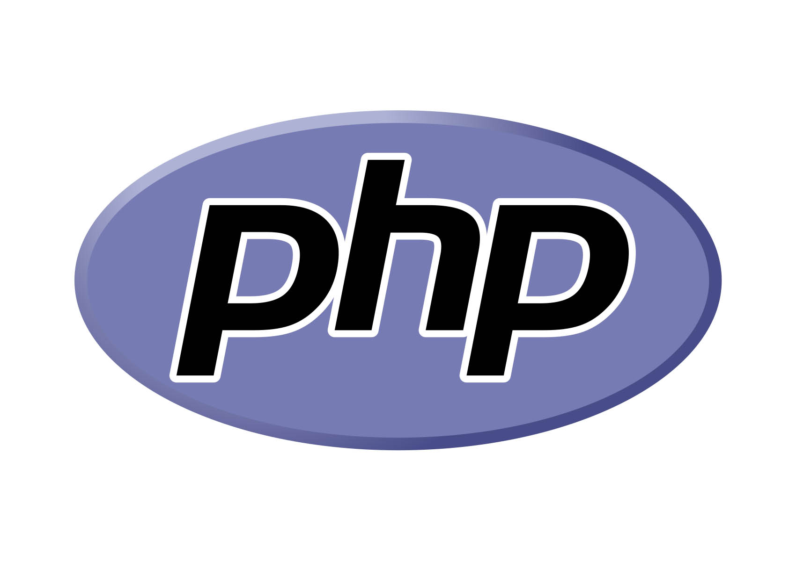
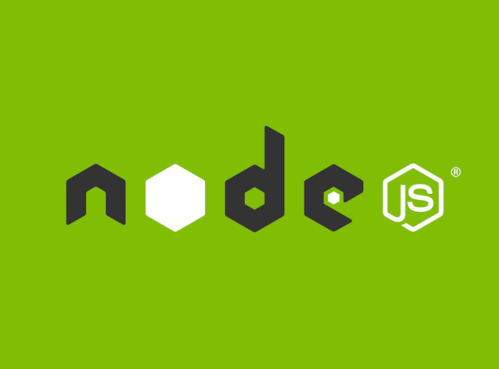

<h1> ✨ Bem vindo ao covil dos projetos privados e dos comits da madrugada. ✨ </h1>

  Esta conta esta destinada e estudos e projetos pessoais voltados para desenvolvimento web e mobile. 

<ul>
  Principais tecnologias:
  <!-- trabalhando -->
  <li>
    
  </li>
  <li>
    
  </li>
   <li>
    
  </li>
  <li>
    
  </li>
   <li>
    
  </li>
   <li>
    
  </li>
   <li>
    
  </li>
  <!-- estudando -->
   <li>
    
  </li>
  <li>
    
  </li>
  <li>
    
  </li>
  <li>
    
  </li>
</ul>

 💬 Caso voce, internauta aleatorio, esteja interessado em parcerias / network, pode entrar em contato :) 

